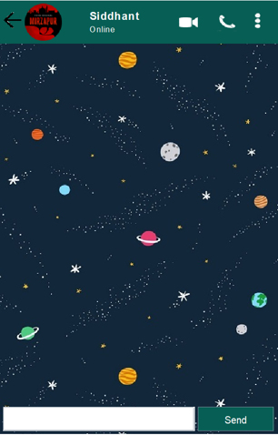
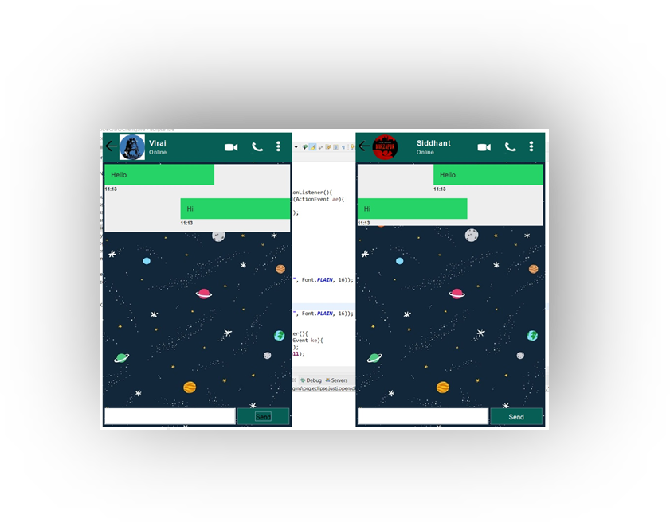

# A-Chat-Application
It's just a basic chat application done in JAVA.
We have taken only two members on the server chatting with each other.

## Overview
Provide a concise overview of what your project is about. Mention its purpose, key features, and any other relevant information.

## Features

- Search rooms and messages.
- Update User Profile: Name, About, Profile Photo.
- Add/Delete Room (only admin or room owner can delete the room)
- Upload photos and videos (cannot upload multiple files).

## 🙂Simple What's APP clone!

## Screenshots

